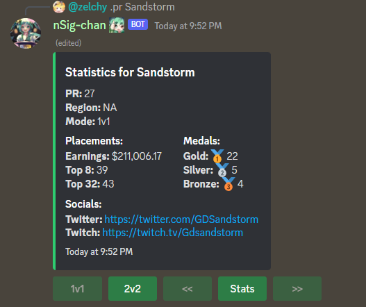
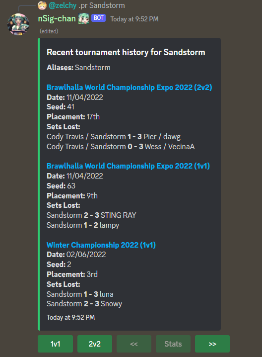
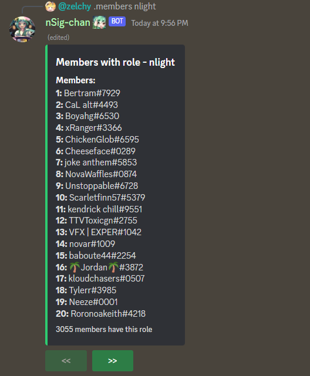
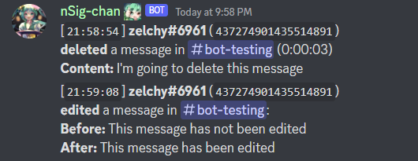
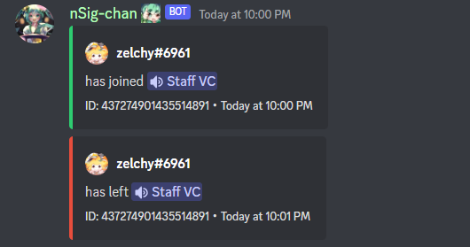

## nSig-chan is a discord bot built in Python using the [discord.py](https://discordpy.readthedocs.io/en/stable/) API wrapper.

### This bot... 
- uses hybrid commands, which means that a command can be invoked with `.` or `/`
- uses requests to query player-based video game statistics
- reads and writes sizeable data through MongoDB

### Sample of commands:

### Sample of logging:

